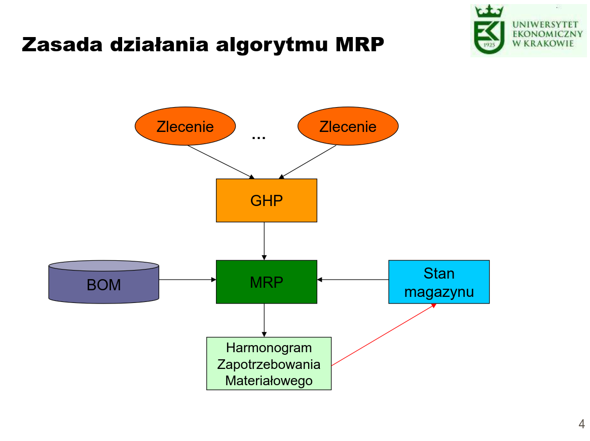
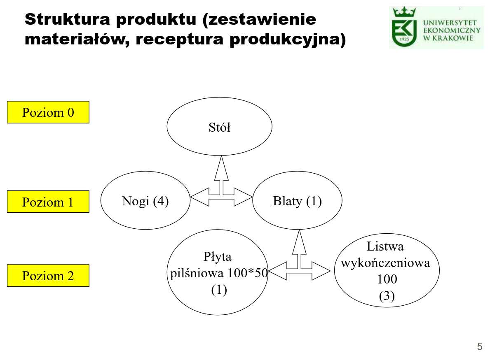
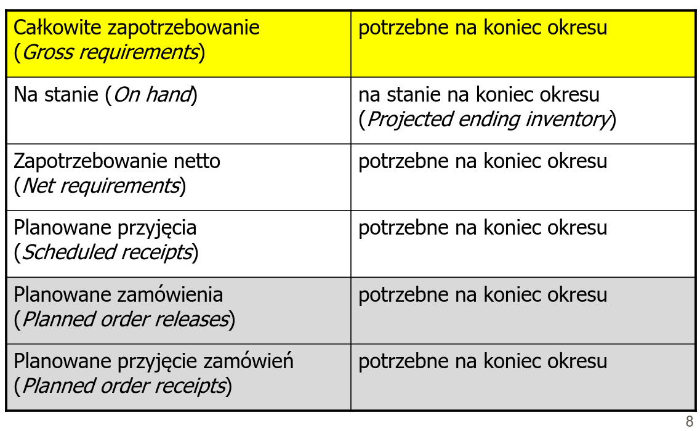

- Algorytm MRP łączy sporządzony harmonogram produkcji z zestawieniem materiałów niezbędnych do wytworzenia produktu, bada zapasy produkcyjne i ustala, które części i surowce muszą być zamówione i w jakim czasie, aby jaknajkrócej były składowane w procesie wytwarzania.
- Uwzględniając kiedy różne części produktu końcowego mają być produkowane według harmonogramu oraz biorąc pod uwagę konieczne okresy otrzymania materiałów, MRP rozdziela w czasie zamówienia na uzupełnienie zapasów w ten sposób, że części i materiały są dostępne w procesie wytwarzania w momencie, kiedy są potrzebne na stanowiskach roboczych.

# Algorytm MRP: źródła informacji
- Główny harmonogram produkcji (GHP) (ang. Master Production Schedule (MPS)
- Struktura produktu (ang. Bill of Materials (BOM))
- Stan zapasów

# Główny harmonogram produkcji

| tydzień            | 1 | 2 | 3 | 4 | 5 | 6 | 7 | 8 | 9 | 10 |
| ------------------ | - | - | - | - | - | - | - | - | - | -  |
| przewidywany popyt | 5 | 5 | 5 | 5 | 5 | 5 | 15 | 15 | 15 | 15 |
| produkcja          |   |   |   | 30 |  |   |   | 30 |  | 30 |
| dostępne           | 15 | 10 | 5 | 30 | 25 | 20 | 5 | 20 | 5 | 20 |
| na stanie = 20     |

# Główny harmonogram produkcji

- dwukrotnie większy popyt w pierwszych 6 tygodniach

| tydzień            | 1 | 2 | 3 | 4 | 5 | 6 | 7 | 8 | 9 | 10 |
| ------------------ | - | - | - | - | - | - | - | - | - | -  |
| przewidywany popyt | 10 | 10 | 10 | 10 | 10 | 10 | 15 | 15 | 15 | 15 |
| produkcja          |   |   |   | 30 |  |   |   | 30 |  | 30 |
| dostępne           | 10 | 0 | -10 | 10 | 0 | -10 | -25 | -10 | -25 | -10 |
| na stanie = 20     |

# Pojęcia w MRP

- zapotrzebowanie netto
    - potrzeby netto = potrzeby brutto – aktualny zapas – zapas już zamówiony
    - obliczanie zapotrzebowania netto (netting) kolejno dla każdego poziomu począwszy od poziomu 0
- czas realizacji (lead time)
    - konieczny do planowania w czasie
- wielkość partii (lot size)

# Rekord MRP (MRP chart)

| \\/ Dane produkcyjne  Okres => |  1 |  2 |  3 |  4 |  5 |  6 |
| ------------------------------ | -- | -- | -- | -- | -- | -- |
| Całkowite zapotrzebowanie      | 10 | 15 | 15 | 10 | 15 | 10 |
| Planowane przyjęcia            |    |    | 25 |    |    |    |
| Przewidywane na stanie         | 20 |  5 | 15 | 5  | 15 | 5  |
| Zapotrzebowanie netto          |    |    |    |    | 10 |    |
| Planowane zamówienia           |    | 25 |    |    |    |    |
| Planowane przyjęcie zamówień   |    |    |    |    | 25 |    |
| &nbsp;
| Czas realizacji = 3
| Wielkość partii = 25
| Poziom BOM = 1
| Na stanie = 30

# Rekord MRP (po zmniejszeniu całkowitego zapotrzebowania w okresie 3 (z 15 do 5))

| \\/ Dane produkcyjne  Okres => |  1 |  2 |  3 |  4 |  5 |  6 |
| ------------------------------ | -- | -- | -- | -- | -- | -- |
| Całkowite zapotrzebowanie      | 10 | 15 |  5 | 10 | 15 | 10 |
| Planowane przyjęcia            |    |    | 25 |    |    |    |
| Przewidywane na stanie         | 20 |  5 | 25 | 5  | 15 | 5  |
| Zapotrzebowanie netto          |    |    |    |    |    | 10 |
| Planowane zamówienia           |    |    | 25 |    |    |    |
| Planowane przyjęcie zamówień   |    |    |    |    |    | 25 |
| &nbsp;
| Czas realizacji = 3
| Wielkość partii = 25
| Poziom BOM = 1
| Na stanie = 30

# Rekord MRP

- Całkowite zapotrzebowanie – pochodzi z poziomu wyżej
- Przewidywane na stanie – wyliczane na koniec każdego okresu, na początku pochodzi z wielkości na stanie
- Planowane przyjęcia – pochodzi ze zleceń / zamówień już uruchomionych (produkcja, zamówienia zakupu)
    - gdy uruchomione zalecenie produkcyjne, wtedy generuje zapotrzebowanie brutto na elementy niższego poziomu
    - zamówienia zakupu nie generują zapotrzebowania na elementy niższego poziomu
- Planowane przyjęcie zamówień – dotyczy zleceń / zamówień, które nie zostały jeszcze uruchomione
- Planowane przyjęcie zamówień (t) = Planowane zamówienia (t – Czas realizacji)
- Przewidywane na stanie (t) = Przewidywane na stanie (t-1) + Planowane przyjęcia (t) + Planowane przyjęcie zamówień (t) – Całkowite zapotrzebowanie (t)

# Procedura MRP

1. Użyj GHP dla znalezienia potrzeb brutto pozycji z poziomu 0.
2. Odejmij zapas, aby otrzymać potrzeby netto pozycji z poziomu 0 i ustal czas rozpoczęcia produkcji, tak aby materiały mogły być dostarczone na czas.
3. Jeśli jest więcej poziomów materiałów, użyj zestawienia materiałów, aby przekształcić potrzeby netto poziomu ostatniego na potrzeby brutto poziomu następnego. Jeśli nie ma już więcej poziomów, można przejść do etapu 5.
4. Przyjmij ilość materiałów do poziomu, a następnie:
    - odejmij zapas na składzie i zaplanowaną dostawę, aby znaleźć wielkość materiałów do zamówienia,
    - użyj czasu realizacji zamówienia i innych istotnych informacji, aby znaleźć czas zamówienia.

Wróć do kroku 3.
5. Jeśli już nie ma żadnych poziomów materiałów, zakończ procedurę.

# Przykład / Zadanie

- Przedsiębiorstwo meblarskie specjalizujące się w produkcji stołów otrzymuje zamówienie na 60 sztuk. Firma kupuje wszystkie potrzebne elementy (według struktury produktu poprzednio podanej, poziom 0) i montuje je w czasie 1 tygodnia.
- Zamówienie ma zostać dostarczone partiami: w piątym tygodniu okresu (20 sztuk) oraz siódmym tygodniu (40 sztuk).
- Przedsiębiorstwo dysponuje aktualnym stanem 2 kompletnych stołów, 40 nóg, 22 blatów oraz 10 płyt pilśniowych.
- Czas dostaw elementów: nogi – 2 tygodnie, blaty – 3 tygodnie, płyta pilśniowa – 1 tydzień.
- Zadanie: Stwórz Główny harmonogram produkcji dla stołów oraz rekordy MRP dla podzespołów (nogi, blaty, płyta pilśniowa).